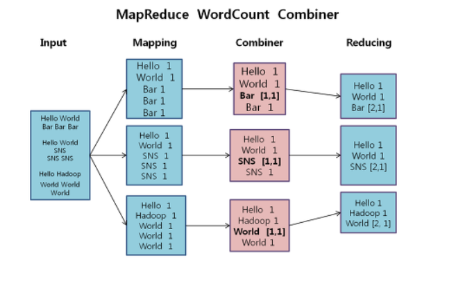
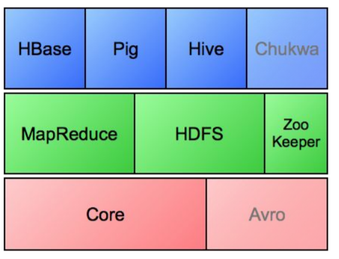

# Overview

### Bigdata
- 현실에서 엄청나게 많은 데이터가 생산되기 시작했다.
- 그리고 이러한 데이터를 통해서 각 각의 요소가 나의 삶에 얼마나 영향을 미치는지가 궁금해지기 시작했다.

### Hadoop
- opensource software framework
- 분산 컴퓨팅(cluster) 환경에서 데이터의 저장(hdfs)과 processing(MapReduce)를 수행하도록 돕는다.
- Hadoop은 이러한 각 각의 node에 실패를 일반적인 현상으로 인식하고, 이에 대한 handling을 제공한다.
- 현재 많은 개발이 진행되었고, 1.x, 2.x, 3.x 와 같이 3가지 버전이 존재한다.

##### Distributed Computing environment
- 분산 컴퓨팅은 commodity hardware(보통의 성능의 컴퓨터)를 여러 개 묶어서 만들어진다.
- Bigdata를 분석하고 저장함에 있어 하나의 노드가 이를 수행하기는 매우 어렵다.
- 현재까지 저장공간이 발전하고 테라 단위까지를 저장할 수 있지만, 이 데이터를 다루기는 만만치가 않다.
- 1 tera data를 쓰고 읽는 것은 하나의 노드가 수행하기에는 너무나 많은 처리 과정이다.
- 따라서, 모든 데이터를 분배하고 이를 여러 개의 노드를 통해 수행하는 것이 빠르게 결과를 구할 수 있는 방법이다.
- 하지만, 이러한 환경도 각 각의 모든 노드의 관리를 하기가 어렵고, 각 각의 output을 종합하기 어렵다는 문제점이 존재한다.

##### Hadoop do
1. Hadoop은 각 node의 실패가 매우 빈번한 일로 인식하고 이에 대한 대책을 갖고 있다.(HDFS)
2. Hadoop은 모든 node의 output을 종합하고 관리할 수 있는 방식을 제공한다.(MapReduce)

### MapReduce
- 하나의 job을 map과 reduce로 나누어 처리한다.
- map은 각 각의 데이터를 key값으로 grouping하는 역할을 수행한다.
- reduce는 grouping되어 넘어온 데이터를 연산하고 처리하는 과정을 수행한다.
- MapReduce는 batch processing(실시간으로 오는 데이터가 아닌 한 번에 모든 데이터를 넘겨주는 방식)을 기본으로 한다.
- ad Hoc방식(중심 노드가 모든 노드를 제어한다. 하지만, 누구든 중심 노드가 될 수 있는 환경, 중심 노드가 실패하게 되면 다른 노드가 이를 수행할 수 있도록 지원한다.)으로 변화무쌍한 dataset을 처리한다.
  

### Hadoop Ecosystem
- Core : 기본적인 FileSystem의 IO를 수행한다.
- Arvo : 데이터를 json 형태로 직렬화하고 정보를 분류한다.
- MapReduce : 묶음 데이터를 분산 처리하기 위해 돕는 framework.
- HDFS : 데이터를 분산 저장하는 시스템.  
(Google File System을 전신으로 한다.)
- Zoo Keeper : 분산 환경에서 서버 간의 상호작용을 제공하는 service.
- HBase : 비관계형 database로 행을 기준으로 데이터 저장한다.  
(Google BigTable을 전신으로 한다.)
- Pig : MapReduce를 사용하지 않고, SQL 유사 script를 이용하여 데이터를 처리하는 방식이다.
- Hive : java를 몰라도 BigData 처리를 가능하게 함. HiveQL이라는 언어를 이용한다.
(FaceBook에서 개발한 Bigdata 처리 방식.)
  

### NoSQL
- SQL(Structure Query Language) : 데이터 관리를 위한 별도의 language. RDBMS와 NoSQL로 나뉜다.
- RDBMS(RDMS) : 데이터가 하나의 Schema를 바탕으로 저장되는 형태이다. form에 알맞은 데이터를 쉽게 접근하고 가져올 수 있다는 장점이 있다. 이외에도 database의 관리에 대한 많은 부분의 관리를 제공한다.  
- Not only SQL : Schema가 정해져 있지 않은 형태의 database.(schema free)  
(schema = 데이터가 의미하는 정보를 저장해놓은 도식)

##### Type
1. key-value
- data를 key와 단순한 value의 짝으로 저장하는 database.
- 대표적으로 AWS의 DynamoDB가 존재한다.
- 단순한 형태의 json의 표현 형식이라고 생각하면 쉽다.

2. document
- key-value 방식과 매우 유사하지만, value가 document가 되는 database.
- 즉, value에 어떠한 또 다른 json이 들어갈 수도 있고, 배열이 들어갈 수도 있는 형태를 Document라고 한다. (종속적인 Tree 형태)
- 대표적으로 MongoDB가 존재한다.
- json의 형태이며 REST API의 전달 형식이기도 하다.

3. column family
- key에 대한 정보를 column으로 한 번 더 분류하고, 이에 대한 정보를 column 단위로 저장하는 database.
- column끼리 유사한 정보끼리는 하나의 family로 묶어서 주변에 같이 배치한다. 
ex. (column1, column2, column3):family  
ex. (name, age, hobby):profile / (happy, sad):mood
- 데이터 검색 방식 : row oriented vs column oriented
  - row oriented는 key에 해당하는 모든 column의 데이터를 한 번에 받을 수 있다.
  - column oriented는 다른 key에 해당하는 동일한 column의 데이터를 한 번에 받기가 편리하다.
- 대표적으로 HBase가 존재한다.

4. graph
- 모든 데이터를 vertex로 표현하고 이들 간의 관계를 edge를 통해 표현하는 database.

### HBase
- 분산 환경에서 data를 효율적으로 저장하기 위한 database.
- Column oriented 이기 때문에 같은 열에 대한 접근 속도가 빠르다.
- 같은 family의 데이터는 반드시 같은 노드에 저장되고, row가 너무 길어진다면, 해당 내용은 다른 node로 쪼개지는 구조로 저장된다.
- scalability를 확보하고, CAP에서 CP를 확보하는 구조이다.
  1. Consistency : 항상 일관성있는 데이터의 저장.
  2. Availability : 성공적으로 데이터의 처리(read/write)가 수행됨.
  3. Partition Tolerance : 특정노드가 장애가 발생한 경우에도 적절하게 동작해야 한다.

##### Hadoop과 NoSQL
- hadoop은 왜 RDBMS를 사용하지 않는가?
  - 데이터를 Read/Write할 때, 대부분의 시간은 그 데이터를 찾는데 사용된다.
  - 따라서 이시간을 줄이는 것이 굉장히 중요하다.
  - 하지만, 데이터 분석에서 원하는 데이터가 정확히 정해져있다면, 정형화된 데이터 즉, RDBMS에서는 데이터의 모든 Row를 가져오는 Row oriented 검색은 너무 느리다.
