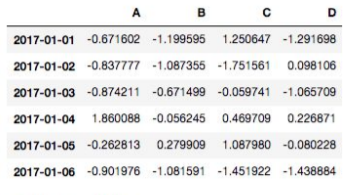

# Spark with Python
- 기초적인 spark와 python 데이터 분석에 관한 라이브러리에 대한 실습 내용.


### Python
##### DataType
- List => []
  - 대부분의 모든 언어에서 지원하는 List 이다.
- Tuple => ()
  - 변화를 허용하지 않는 read-only data 구조이다.
  - 이로 인해 List보다 더 빠른 속도로 데이터를 읽을 수 있다.
- Dictionary => {}
  - key와 value로 mapping되는 두 데이터의 쌍으로 저장한다.
  - key값으로 다양한 변수를 사용할 수 있어 굉장히 유연하게 사용할 수 있다.
- Set => set()
  - 일반적인 수학의 집합을 의미한다.

##### Pandas
- numpy를 기반으로 만들어진 python library이다.
- Pandas는 대용량의 데이터를 처리하는데 유연하고 빠르며, 아름답게 데이터를 보여준다.
- 기본은 DataFrame이라는 구조를 통해 생성한다.
- Series는 하나의 열을 의미한다.
- data를 자르고 가공하는데 많은 도움을 준다.(Slicing & Sorting)
- data를 삽입할 때에는 없는 index를 만들어서 이어붙일 수도 있다.

```python
import pandas as pd
import numpy as np

dates = pd.date_range('20190101', periods = 6)

df = pd.DataFrame(np.random.randn(6,4), index = dates, columns = list('ABCD'))
```



##### Matplot
- numpy를 기반으로 만들어진 python library이고, pandas 도표를 graph로 변환하는 것 역시 자유롭게 가능하다.
