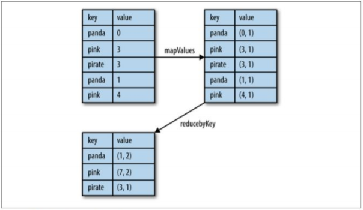
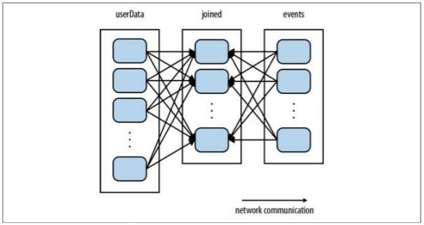
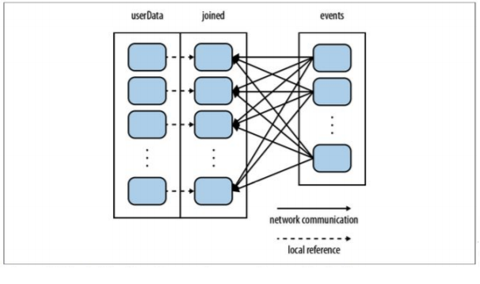

# Advanced Spark

### Work with Key, Value
- Pair RDD
  - RDD 중에서도 key/ value 쌍으로 이루어진 RDD를 Pair RDD라고 부른다.
  - Pair RDD는 데이터를 가공하고 병렬화하는데 매우 효과적이므로, 이를 잘 이해해두는 것이 좋다.

- Pair RDD를 만들기 예시.
  `pairs = lines.map(lambda x: (x.split(" ")[0], x))`

- Skew : key값에 따른 데이터 분포가 한 곳으로 쏠린 상태이다.

### Transformation
- Skew 현상이 발생할 때, 적절한 데이터 변형은 효율성을 끌어올릴 수 있다.

- reduceByKey(funct) 
=> key값을 기준으로 연산을 수행한다.

- groupByKey() 
=> key값을 기준으로 value를 묶어서 하나의 List로 만든다.

- values() 
=> key를 제외한 value들을 불러온다.

- sortByKey() 
=> key를 기준으로 데이터를 정렬한다.

- subtractByKey(otherRdd) 
=> otherRdd와 key값이 동일한 데이터를 제거한다.

- join(rdd) 
=> otherRdd와 key값이 동일한 value를 tuple로 묶는다.

##### Aggregation
- 대표적인 예가 reduceByKey이다.
- 변형된 데이터에 연산을 수행한다.
- ex. `rdd.mapValues(lambda x: (x,1)).reduceByKey(lambda x,y : (x[0] + y[0], x[1] + y[1]))`

##### join
- Pair RDD에서 Joinning은 매우 일상적인 일이다.
- right, left outer join / cross join / inner join 4가지를 모두 spark에서는 지원한다.
  - right outer join : right를 먼저 고려한 후, 
  그 후에 left에 넣을 수 있는 게 있다면,  
  추가하고 아니라면 NULL을 추가한다.
  - cross join : 가능한 모든 경우의 수를 table의 포함한 형태. 
  key값 같은 것은 고려하지 않고, table이 합쳐지는 모든 경우의 수를 나타낸다.
  - inner join : 둘이 공통으로 가지는 부분을 합한다.

##### Sorting
- Pair RDD도 Key값을 기준으로 정렬할 수 있다.

##### Partitioning
- 분산 환경에서의 communication은 매우 고비용이다.
- 이를 줄이는 것은 성능향상에 엄청난 효과를 줄 수 있다.
- join과 같은 key에 기반한 연산을 여러 번 재사용할 때, 특히 더 많은 이득을 볼 수 있다.
- 핵심은 매 반복마다 계속 가져오는 데이터를 caching하는 것이다.
- 여기서 partitioning은 각 각의 node의 수 만큼 partitioning을 수행하게 되면, 항상 사용되는 node에 데이터가 고정되고 이를 caching하면 후에는 data를 시스템에서 불러오는 비용을 확연하게 줄일 수 있다.
- persist라는 keyword를 사용하게 되면 해당 데이터는 다시는 바뀌지 않는다.

Basic working

Partitioning + Caching

- partitioning의 방식
  - hash partitioning
    - hash function을 통해서 데이터를 프로그래머가 정한 숫자로 partitioning하는 방식.
  - range partitioning
    - 단순하게 일정 범위만큼을 쪼개서 사용하는 방식.

- partitioning으로 이득을 볼 수 있는 연산
  - join()
  - leftOuterJoin()
  - rightOuterJoin()
  - groupByKey()
  - reduceByKey()
  - combineByKey()
  - lookup()  
- partitioning을 수행하는 효과가 있는 연산
  - cogroup()
  - groupWith()
  - join()
  - leftOuterJoin()
  - rightOuterJoin()
  - groupByKey()
  - reduceByKey()
  - combineByKey()
  - partitionBy()
  - sort()
  - mapValues()
  - flatMapValues()
  - filter()

- Partitioning도 Transformation이다.  
즉, 이 연산 역시 original RDD를 변형하는 것이 아닌, 새로운 RDD를 return하는 것이다.
- 따라서, 이를 original file에 저장하는 것이 아닌 새로운 형태로 저장해야한다.
