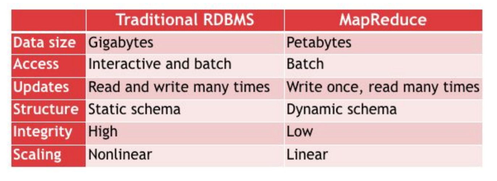

# Hadoop Basic

### DataBase transaction & ACID
- transaction  
  Query를 수행하는 중에 실행이 중단되었을 경우, 처음부터 다시 실행하는 Rollback을 수행하고, 오류없이 수행을 마치면 commit을 수행하는 하나의 단위이자 이러한 행위를 칭함.

1. Atomicity
  - transaction이 중단되지 않음을 보장하는 것.
  - 중간중간에 savepoint를 두어 이로인한 손실을 최소화한다.
2. Consistency
  - transaction이 종료된 후 데이터의 형태가 변화지않고 유지되는 것.
  - trigger와 handler를 명시함으로서 이를 해결한다.
3. Isolation
  - transaction 간에 간섭이 발생하지 않고 독립적으로 수행됨.
  - LOCK을 통해서 이를 구현한다. 잘못 Lock 발생하면 deadlock이 생긴다.
4. Durability
  - 한 번 성공한 transaction은 반드시 성공하는 특성.

### comparison
1. B-tree vs MapReduce
  - B-tree가 데이터가 적을 때는 더 빠르게 수행할 수 있다.
  - 데이터가 많아짐에 따라, node를 거쳐야하는 overhead가 급격히 증가한다.
2. Structured data vs semi-Structured data vs unStructured data
  - MapReduce는 semi-Structured data set을 이용하는 것을 지향한다. unStructured는 bigData에 대한 효율성이 너무 떨어지고, Structured data에 비효율적인 데이터 접근을 해결하는 구조이기 때문이다.(그리고, scale out에 대한 효율성이 훨씬 높기 때문이다.)

### RDBMS vs MapReduce

