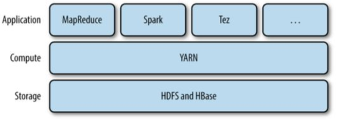

# Yarn
- Yarn은 하둡의 클러스터 자원을 관리해주는 system이다.(bottleneck 등을 해소)
- 이 system은 MapReduce의 수행을 향상시키기 위해 사용되었지만, 
다른 분산환경에서도 휼륭하게 사용되고 있다.
- yarn은 API를 제공하지만, 
이는 사용자가 직접 사용하는 것이 아닌 다른 분산환경 framework들에 의해서 사용됩니다.

  

### Architecture
- 두 개의 manager를 통해서 resource를 관리한다.(ResourceManager, NodeManager)
##### ResourceManager
- cluseter 하나 당 하나씩만 존재한다.
- cluster 내의 모든 자원을 관리하고 scheduling한다.
- Scheduler, applicationManager, ResourceTracker가 존재한다.

##### NodeManager
- master node를 제외하고 노드 당 하나씩 붙어 node를 관리한다. 각 노드를 실행시키고 모니터링한다.

### Workflow
- 1. 클라이언트가 ResourceManger에게 job을 의뢰
- 2. ResourceManager는 applicationMaster를 실행시킬 수 있는 node를 찾고 해당 노드에게 할당한다.(container까지 만들어낸다.) 그 후에 application의 요구사항을 수행한다.
- 3. 만약, applicationMaster만으로는 실행이 어렵다면, 추가적인 container를 ResourceManager에게 요청한다.(heartbeat)
- 4. ResourceManager가 대상을 지정하면, applicationMaster는 새로운 container를 추가로 사용한다.

### Benefit
- YARN은 자원요청에 대해 유연한 모델을 가지고 있다.
- 컨테이너 요청은 컴퓨터 리소스의 양을 나타내며 컨테이너에 대한 locality를 지원한다.
- 여러 application을 동시에 처리하는 것이 유연하고 좋다.

### Original MapReduce vs YARN MapReduce
- JobTracker의 역할은 Resource manager, application master, timelineserver로 나뉘어 부하를 줄일 수 있게 되었다.
- TaskTracker는 NodeManager로 변하였고, Slot이 Container로 대체되었다.

- Scalability
  - yarn은 더 큰 클러스터 환경에서도 좋은 성능을 보여준다.
  - jobTracker의 job과 task의 관리를 두 개의 resource manager와 application master로 나누었다.
  - yarn은 scale out을 더욱 효율적으로 할 수 있다.
- availability
  - 기존의 job tracker에서 너무나 많은 처리로 고가용성을 보장하기 위한 조치가 어려웠다.  
  고가용성 : 하나가 fail 되었을 때, 다른 node에서 빠르게 이를 복제하여 자신이 수행하는 것.
- utilization
  - 기존에는 map과 reduce로 나뉘어져있던 slot을 하나의 resource pool로 만들어서 놀고 있는 slot이 없도록 만들었다.
- multitenancy
  - MapReduce이외의 service를 Hadoop위에서 돌리는 것이 가능하다.

### Yarn's Scheduling
- FIFO Scheduling
  - 들어온 순서대로 Queue에 저장
  - configuration은 쉬운데 적절한 사용은 불가능하다.
- Capacity Scheduling
  - queue를 여러 개 설치하여 수행한다.
  - 약간은 작업을 동시에 할 수 있다.
- Fair Scheduling
  - 현재 할당된 모든 작업을 나누어서 실행하고 끝나면 해당 자원을 돌려준다.
- Delay Scheduling
바쁜 상황에서 중요한 하나의 application이 특정한 node를 요청한다면, 다른 container가 해당 node를 사용 중일 가능성이 크다. 
이때, locality에 따라 이를 인접 node(동일한 rack에 있는)에게 작업을 할당한다. 
그런데 오히려 이런 과정을 수행하는 것보다 차라리 해당 node의 작업이 끝날 때까지 기다리는 것이 더 빠를데가 있다. 이것을 이용한 것이 Delay scheduling이다.
