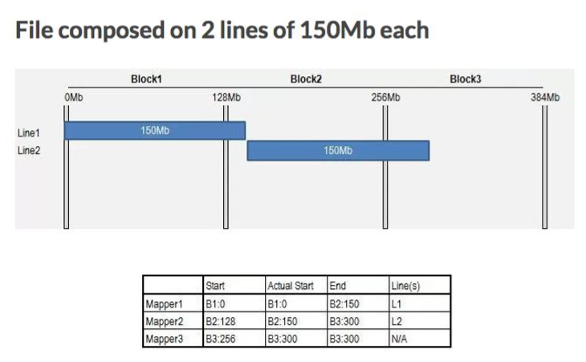
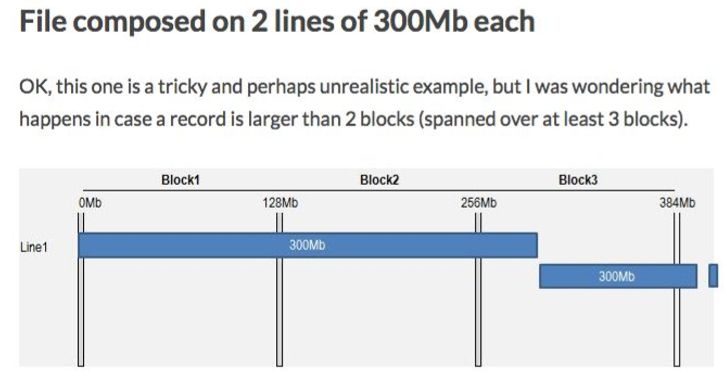

# Hadoop's IO

### Block
- Hadoop은 Input data를 HDFS에 128mb 단위로 저장한다.

### Split
- MapReduce에서 처리를 수행하기 위해서 해당 block을 여러 개의 map task에 분배되, 이때 map하나에 전달되는 data가 split이다.
- 만약, split 단위가 다른 block의 내용을 요청한다면, 이또한, 불러온다.(이 기능 Record Reader가 수행한다.)
- split은 하나의 line단위로 이루어진다.

### two example

- 만약, 1 line에 150mb인 데이터를 읽어야 한다면!
- Mapper1는 0부터 150까지 수행할 것이고, 실제로도 0에서 시작한다.
- Mapper2는 128 ~ 300까지 수행할 것을 기대하지만, 실제로는 150mb부터 실시하여 300까지 수행한다.
- Mapper3는 256부터 300까지 수행할 것을 기대하지만, 아무것도 수행하지 않고 단지 데이터를 보내주는 역할만 한다.

- Mapper1은 0부터 300까지 수행할 것이고, 실제로도 0에서 시작할 것이다.
- Mapper2와 실행되지않고 데이터를 순수히 읽는데만 사용된다.
- Mapper3는 300부터 600까지의 데이터를 수행하고 256부터 300까지는 데이터를 보내주는데에서 그친다.

### Data integrity(무결성)
- 디스크나 네트워크의 IO의 경우 오류 가능성이 적다.
- 손상된 데이터를 감지하는 일반적인 방법은 데이터가 처음들어갈 때, 이에 대한 checksum을 계산하는 것이다.

##### Checksum
- 전송 또는 저장 중에 발생할 수 있는 에러를 감지하기 위해 임의의 데이터 블록을 추가하는 것.
- HDFS는 기록된 모든 데이터를 공개하고, 읽을 때마다 이 Checksum을 확인한다.
- 따라서, datanode는 항상 이 값을 확인하고, 데이터를 저장한다.
- checksum에 오류가 있다면, 복사된 block을 불러와서 복구한다.

### Compression
- 압축의 성능을 비교하는 지표는 압축효율성과 압축 시간, 압축 해제 시간이다.
- Hadoop은 I/O 작업에서 압축작업을 포함한다.
  - 저장 공간을 줄일 수 있다.
  - data를 전송하는 속도를 올릴 수 있다.

##### Trade-off
- 압축을 하는 시간과 푸는 시간으로 인한 overhead가 발생한다.

##### Types
- Gzip : 일반적인 경우 많이 사용되는 압축방법이다.(성능이 밸런싱 있다.)
- Bzip2 : gzip보다 효율적인 압축이 가능하지만, 더 느리다. 그래도 압축을 푸는 속도는 하는 속도보다는 조금 더 빠르다.
- LZO, LZ4, Snappy등은 속도에 치중했지만, 효율적인 압축을 수행하지는 못한다.

##### Compression in MapReduce
- MapReduce를 진행할 데이터의 압축방식은 splitting을 지원해야 한다.
- Bzip2는 이를 지원하기 때문에 Gzip보다 훨씬 훌륭한 수행을 보장할 수 있다.
- 이러한 splitting을 지원하지 않는 방식을 사용하기 위해서는 직접 split를 수행해주어야 한다.  
직접 flag file을 만드는 행위
- 좋은 file format을 사용하는 것이다. 이로 인한 압축효율의 상승이 크다.

### Serialization
- 기본적으로 MapReduce는 RPC(Remote Processor Call)방식이다.
- 따라서, 데이터를 전송할 때, 직렬화를 수행하게 되면 많은 이득이 있다.
  - 간결함
  - 빠름
  - 확장성이 있다
  - 상호 교환이 가능하다.
- 이를 위해서 MapReduce에서는 여러가지 data Type을 생성하여 직렬화를 수행하였다,

### Writable
- MapReduce의 직렬화를 위한 자료형이다.
- boolean 부터 char를 제외하고 모두 있다.(string은 Text라는 이미 있는 직렬화 기법을 사용한다.)
