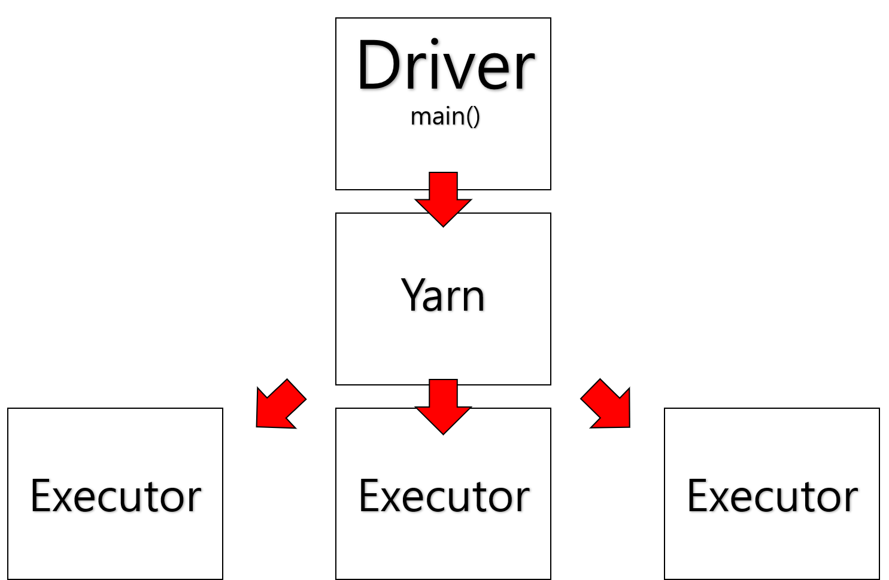

- 여태까지의 MapReduce를 먼저 집고 넘어가자.

### MapReduce
- 대규모의 데이터셋을 클러스터 환경에서 병렬적이고 분산적으로 처리하고 생성하는 programming model이다.
- Map은 sorting과 filter를 수행하는 것이 일반적이다.
- Reduce는 operating과 결과를 정리하는 것이 일반적이다.
- 수요가 늘어나면서 여러가지 요구사항이 발생했다.
  - 더 복잡하고, 다양한 요인 존재하는 데이터의 분석.
  - 더 간단하고, 편리한 데이터 분석.
  - 실시간적인 streaming processing
  - iterative 작업의 효율적인 수행.

# Spark

### RDD(Resilient Distributed Datasets)
- 탄력성있는 분산 데이터셋
- cluster 전역에 메모리에 cache된 메모리 물체의 모음을 분산한다.
- 병렬 수행을 잘 처리한다.
- 자동적으로 실패를 재계산한다.
- 불변적이다.(read-only)
- record를 분산저장한다.
- 다양한 programming language를 지원한다.

### Transformation
- RDD를 변형하여 새로운 RDD를 만드는 연산이다.
- Lazy Evaluation
  - RDD에 대한 transformation operation은 Action이 수행될 때, 한 번에 모두 수행된다.
  - Action에 따라 가장 효율적인 방식을 수행하기 위해서이다.
- 대표적인 함수
  1. map(funct) => RDD의 각 요소에 특정 함수를 수행 
  `sc.parallelize([2,3,4]).map(lambda x:[x,x,x]).collect()`  
  `result : [[1,1,1],[2,2,2],[3,3,3]]`
  2. flatMap(funct) => 각 요소에 똑같이 적용하는 것은 동일하지만, 배열 또는 다른 요소로 감싸져 있는 특징을 무시하고, 각 각을 하나의 요소로 받아들인다.(출력도 동일하게 구분없이 수행)(예외 상황에 유연한 데이터 처리를 가능하게 한다.) 
  `sc.parallelize([2,3,4]).flatMap(lambda x:[x,x,x]).collect()` 
  `result : [1,1,1,2,2,2,3,3,3]`
  3. filter(funct) => funct안에 특정 조건을 집어넣으면 특정 요소는 제거된다. 
  `sc.parallelize([2,3,4]).filter(lambda x: x != 1).collect()` 
  `result : [2,3]`
  4. distinct() => 중복을 제거한다. 
  `sc.parallelize([2,3,4]).flatMap(lambda x:[x,x,x]).distinct().collect()` 
  `result : [1,2,3]`
  5. reduceByKey(funct) => 같은 key를 가진 데이터의 값을 function에 따라 통합한다.  
  `sc.parallelize([(1,2), (3,4), (1,8)]).reduceByKey(lambda x,y: x+y).collect()` 
  `result : [(1,10), (3,4)]`
  6. groupByKey(funct) => 같은 key를 가진 데이터를 하나의 key에 배열로 합칩니다. 
  `sc.parallelize([(1,2), (3,4), (1,8)]).groupByKey().collect()` 
  `result : [(1,10), (3,4)]`

### Action
- 최종 상태를 출력할 때 사용하는 함수이다.
- action은 최종 Evaluation을 수행할 것을 요청하고, 실제 output을 얻기 위한 모든 transformation이 실행된다.
- 대표적인 함수
  1. collect()=>RDD의 모든 element를 출력한다. 
  `sc.parallelize([1,2,3,3]).collect()` 
  `result : [1,2,3,3]`
  2. count()=>RDD의 모든 element의 수를 출력한다. 
  `sc.parallelize([1,2,3,3]).count()` 
  `result : 4`
  3. countByValue()=>RDD의 모든 element각 각의 수를 출력한다. 
  `sc.parallelize([1,2,3,3]).countByValue()` 
  `result : [(1,1),(2,1),(3,2)]`

### Lazy Evaluation
- RDD에 대한 transformation을 요청했을 때, 이를 바로 수행하지 않는 것이다.
- spark는 내부적으로 이 기록들으 metadata로 기록하고 있다가 action이 수행될 때, 가장 최선의 방식을 고려하여 수행한다.

### Spark Components

- Driver : 실제로 code가 작성되는 부분이다.
- Yarn : Cluster 시스템을 관리할 하나의 cluster master이다.
- Executor : spark job을 실제로 수행하는 노드를 의미한다.
